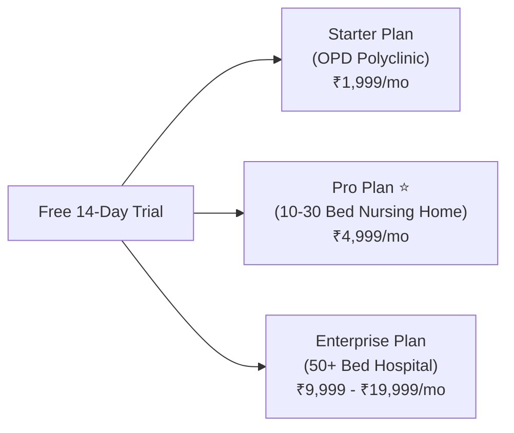

# MedSphere AI Hospital OS — Commercial Go-To-Market (GTM) Strategy

A comprehensive roadmap for launching, pricing, positioning, and scaling **MedSphere AI** across nursing homes, polyclinics, diagnostic labs, and multi-specialty hospitals.

---

## 🎯 1. Target Customer Segmentation (Ideal Customer Profile)

| Segment | Facility Type | Primary Pain Point | Conversion Potential |
| :--- | :--- | :--- | :--- |
| **Tier 1 (Primary Target)** | **10–50 Bed Nursing Homes & Clinics** | Paper-based records, high administrative overhead, compliance pressure | **VERY HIGH (Fastest Sales Cycle: 3–7 Days)** |
| **Tier 2** | **Multi-Specialty Polyclinics / OPDs** | Slow patient queues, manual billing errors, no AI diagnostic support | **HIGH** |
| **Tier 3** | **Diagnostic & Pathology Labs** | Lack of automated panic-value flagging & printable digital reports | **MEDIUM** |
| **Tier 4** | **50–150 Bed Regional Hospitals** | Legacy software lock-in, ABDM M3 integration complexity | **HIGH (Higher Deal Size)** |

> [!TIP]
> **Why Focus on Tier 1 Nursing Homes First?**
> Small to mid-size nursing homes (10–50 beds) make buying decisions in 24–48 hours directly through the owner doctor. They lack dedicated IT teams and will love a zero-installation, web-based SaaS solution like MedSphere AI.

---

## 💡 2. Core Value Proposition & Positioning

When presenting MedSphere AI to hospital owners and medical directors, position the platform using **3 Key Pillars**:

1. **🚀 100% Zero-Hardware Setup:**
   * Runs directly inside Google Chrome, Microsoft Edge, or Safari on any laptop, desktop, or mobile tablet.
   * No local server installations, maintenance fees, or expensive hardware required.

2. **🧬 Built-in Clinical AI Intelligence:**
   * **10-Parameter Pathology Anomaly Detector** (Automated panic red-flag detection).
   * **AI Emergency Triage Analyzer** (ESI Level 1–5 bed routing).
   * **AI Oncology & Precision Cancer Agent** (Tumor biomarker & targeted therapy guidance).

3. **🛡️ 100% ABDM M3 & DPDP Act 2023 Compliant:**
   * Instant 14-digit ABHA Health ID generator.
   * 256-bit SSL encrypted patient records with printable NABH-ready EULA certificate.

---

## 💰 3. SaaS Pricing & Subscription Packages

Implement a monthly/annual SaaS recurring revenue model:



### Proposed Subscription Plans:

| Plan | Price (India) | Price (International) | Features Included |
| :--- | :--- | :--- | :--- |
| **Starter (Clinic / OPD)** | **₹1,999 / month** | **$29 / month** | Up to 3 Doctors, Manual OPD Entry, Digital Prescriptions, Basic Billing & Receipts. |
| **Professional (10-30 Bed)** ⭐ | **₹4,999 / month** | **$69 / month** | All Starter features + Ward Bed Allocation Map, Insurance Pre-Auth Verifier, ABHA ID Generator, AI Lab Anomaly Detector, 24/7 Cloud DB Backup. |
| **Enterprise (50+ Bed)** | **₹9,999 – ₹19,999 / month** | **$149 – $299 / month** | Unlimited Doctors & Beds, AI Oncology Agent, Custom Hospital Logo Branding, Multi-Branch Support, Priority Support. |

> [!NOTE]
> **Annual Payment Discount:** Offer a **20% discount** when clients pay for 1 full year upfront (e.g., ₹48,000/year instead of ₹60,000/year). This builds upfront cash flow for your business!

---

## 🚀 4. Go-To-Market Sales & Distribution Channels

### Channel 1: On-Ground Field Sales (Medical Rep / Business Development)
* **Strategy:** Hire 1–2 sales executives with healthcare or pharmaceutical backgrounds.
* **Target Area:** Visit hospital clusters & nursing home belts in your city.
* **Execution:** Perform a live 5-minute demo on an iPad or laptop directly to the Managing Director / Senior Doctor.

### Channel 2: Partner Network (Pharma & Surgical Suppliers)
* **Strategy:** Partner with local medical equipment distributors, diagnostic machine vendors, and pharmaceutical representatives who already visit 50+ nursing homes weekly.
* **Incentive:** Offer them a **15% recurring affiliate commission** for every hospital they onboard.

### Channel 3: Digital B2B Outreach (LinkedIn & WhatsApp)
* **Target Roles:** Hospital Director, Managing Trustee, Chief Medical Officer (CMO), Nursing Home Owner.
* **Cold Message Script (WhatsApp / Email):**
  > *"Respected Dr. [Name], We noticed [Hospital Name] manages high daily patient intake. We have launched **MedSphere AI** — an ABDM-ready, AI-powered Hospital OS that automates patient registration, 14-digit ABHA IDs, AI Lab Anomaly alerts, and GST billing in under 10 seconds. Try our live demo: https://hospital.technocons.com/ — Would love to offer a 14-day free trial for your clinic."*

### Channel 4: Accreditation & Compliance Consultants
* **Strategy:** Connect with NABH & ABDM compliance consultants. They consult hospitals on how to meet digital health regulations. MedSphere AI gives them an instant solution for their clients.

---

## 🎬 5. Winning 5-Minute Live Product Demo Script

When demonstrating MedSphere AI to a prospect, follow this exact sequence to showcase maximum value:

```
[Minute 0:00 - 1:00]  ➜ 1-Click Patient Intake & Instant 14-Digit ABHA ID Generator
[Minute 1:00 - 2:30]  ➜ AI Pathology Anomaly Scan (Show Troponin / Potassium Panic Flags)
[Minute 2:30 - 3:30]  ➜ Insurance Verifier & 1-Click Cashless Pre-Auth Letter
[Minute 3:30 - 4:30]  ➜ 1-Click Printable Tax Invoice & Pharmacy Discharge Bill
[Minute 4:30 - 5:00]  ➜ Legal EULA, DPDP Act 2023 & ABDM Compliance Certificate
```

---

## 🛠️ 6. Post-Sales Onboarding & Customer Support

1. **Self-Serve Onboarding:** Provide a 1-page PDF quick-start guide.
2. **Cloud Sheet Data Import:** Use the built-in **IT Admin Cloud Importer** to upload their existing Doctor roster and Patient sheets via Excel/CSV.
3. **Dedicated WhatsApp Support Group:** Create a private WhatsApp group with the hospital management team for instant technical assistance.

---

> [!IMPORTANT]
> **Recommended Immediate Next Step:**
> Print or save this Go-To-Market Strategy document, set up your initial pricing page or pitch deck, and reach out to your first 5 local nursing home contacts for a 14-day free trial!
